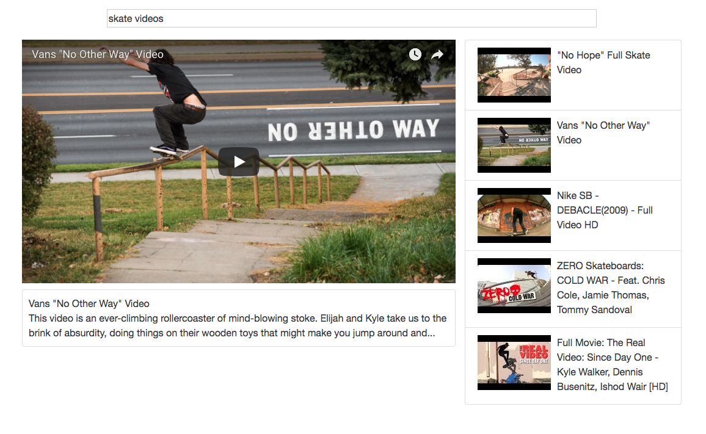

# YouTube Clone

A baby YouTube clone to continue learning [React](https://reactjs.org/). Requests to the YouTube API are made through the [`youtube-api-search`](https://www.npmjs.com/package/youtube-api-search) package, and parent-child communication is performed by passing callbacks down from the `App` component. This is done to avoid the extra overhead of [Redux](https://redux.js.org/) and to simply stick with React for now.

  

### Prerequisites

You'll need [Yarn](https://yarnpkg.com/en/) or [npm](https://www.npmjs.com/) installed.

You'll also need to have a [YouTube API key](https://developers.google.com/youtube/).

### Installing

Run:

```
npm install
```

or

```
yarn install
```

### Running the Project

To run the project, you need to create a `.env` file in the root directory. In this file, add `YOUTUBE_API_KEY=YOUR_API_KEY` where `YOUR_API_KEY` is replaced by the YouTube API key you received after signing up [here](https://developers.google.com/youtube/).

The project runs locally on port `8080` with `webpack-dev-server`. To fire up
the application, run:

```
npm start
```

or

```
yarn start
```
